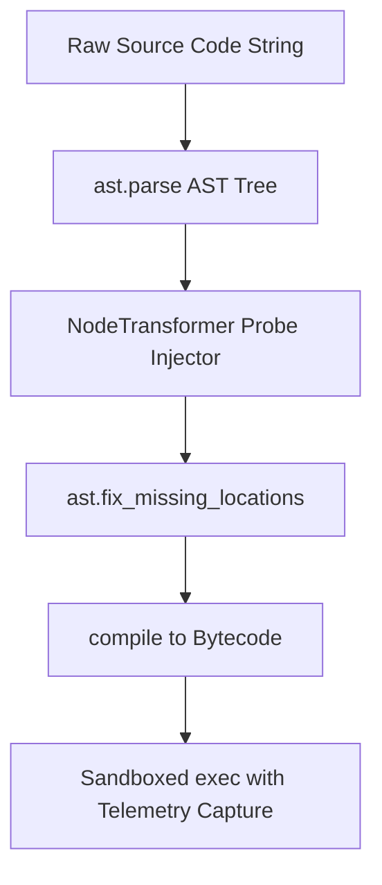

# GenPark Dynamic AST Transformer Instrumentation Skill

AST node transformer rewriting Python ASTs to inject telemetry probes, timers, and parameter inspection hooks.

Read more at [GenPark](https://genpark.ai) and the [GenPark MCP Catalog](https://genpark.ai/mcp).

## Features
- In-memory AST manipulation without modifying disk source files.
- Automated function entry and exit hook injection.
- Zero external dependencies.
